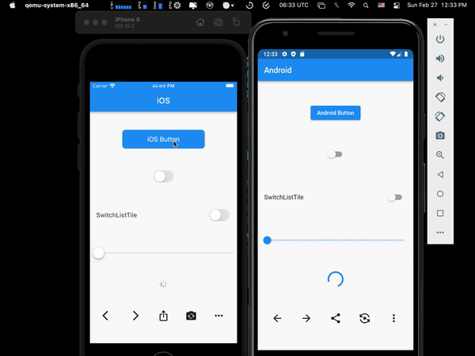

# Flutter Adaptive Widgets - [YouTube](https://www.youtube.com/watch?v=4QdsluVt8dc)

</img>

    Since flutter application runs on both android & ios platform, it is a good idea for the developer to keep the UI uniform for those specific platform.
    Adaptive widgets are a great way to keep the UI uniform in both platforms. This repo contains few of the adaptive widgets. But there are more to implement like: date picker, time picker, bottom tab bar etc.

## Demo

